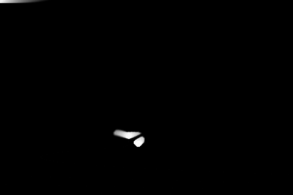

# Shader experiments

This repository contains several shader experiments to explore the capabilities of the GLSL language.

It currently contains:
- an outline shader [here](OutlineShader)
- a smoke shader [here](https://github.com/rbaltrusch/smoke_shader)



## Getting started

Clone the repository, then run one of the shader examples provided (you will need a local [LÖVE 11](https://love2d.org/) installation):

```
git clone https://github.com/rbaltrusch/shaders
cd shaders
call love OutlineShader
```

## License

This repository is open-source and licensed under the [MIT license](LICENSE).
